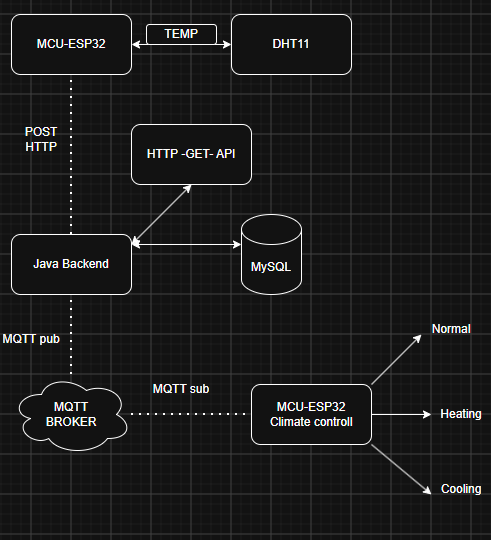

# ESP32 + Java Spring + MQTT Climate Project

This repository is a hands-on embedded systems and backend learning project. Its main purpose is educational: I am using it to explore how an ESP32 device can read sensor data, send it to a backend, store it in a database, and interact with another ESP32 through MQTT for a simple climate-control scenario.

The project combines three connected parts:
- an ESP32 firmware project that reads a DHT11 sensor,
- a Java Spring backend that receives and stores temperature data,
- a second ESP32-based climate controller that listens for MQTT commands and switches between normal, heating, and cooling modes.

This is not intended as a production-grade industrial solution. It is a personal learning project designed to practice embedded programming, HTTP communication, MQTT messaging, databases, and backend integration.

Project overview
----------------
The system follows this flow:

In simple terms:
1. The ESP32 sensor node reads temperature and humidity from a DHT11 sensor.
2. It sends the measurements to the Java backend over HTTP.
3. The backend stores the values in MySQL.
4. The backend or application logic can publish MQTT messages to a broker.
5. A second ESP32 climate controller subscribes to those messages and changes its state to Normal, Heating, or Cooling.

Repository structure
--------------------
- Esp/ — ESP-IDF firmware for the temperature sensor node.
- ClimateControll/ — ESP-IDF firmware for the MQTT-driven climate controller.
- TempHibernate/ — Java Spring backend application.
- README.md — project overview and setup notes.

What I am learning with this project
------------------------------------
- Reading and interpreting DHT11 sensor data on ESP32.
- Using ESP-IDF and C for embedded firmware development.
- Sending JSON data from ESP32 over HTTP.
- Building a backend with Java and Spring.
- Persisting data in MySQL.
- Using MQTT for device-to-device communication.
- Creating a small IoT-style system with multiple components.

Key features
------------
- DHT11 temperature and humidity reading on ESP32.
- Wi-Fi connectivity and HTTP POST requests from the sensor node.
- Java backend support for receiving and storing readings.
- MySQL persistence for collected temperature data.
- MQTT-based climate control messages for a second ESP32 device.
- Simple climate modes: Normal, Heating, and Cooling.

Hardware and software used
--------------------------
- ESP32 development boards
- DHT11 sensor
- Wi-Fi network
- MQTT broker
- MySQL database
- ESP-IDF toolchain
- Java JDK and Gradle
- Spring Boot backend

How the system works
--------------------
- The temperature sensor firmware reads values from the DHT11 sensor.
- The measurements are packaged and sent to the backend with HTTP.
- The backend stores the readings in the database.
- MQTT is used to send simple climate instructions to the controller device.
- The climate controller firmware responds by changing its mode accordingly.

Educational note
----------------
This project is mainly for my own learning and experimentation. I am using it to understand how embedded devices, web services, databases, and messaging systems can work together in one small IoT application.

Getting started
---------------
1. Set up the ESP-IDF environment for the ESP32 projects.
2. Configure Wi-Fi credentials, backend URL, and MQTT broker settings.
3. Build and flash the sensor firmware from the Esp/ folder.
4. Build and run the Java backend from the TempHibernate/ folder.
5. Build and flash the climate controller firmware from the ClimateControll/ folder.
6. Verify that data flows from the sensor to the backend and that MQTT commands control the climate device.

Notes
-----
- Credentials and network settings should be kept private.
- The current implementation is a learning prototype and may be improved over time.
- The project can be expanded with better error handling, security, dashboards, and more advanced automation.
